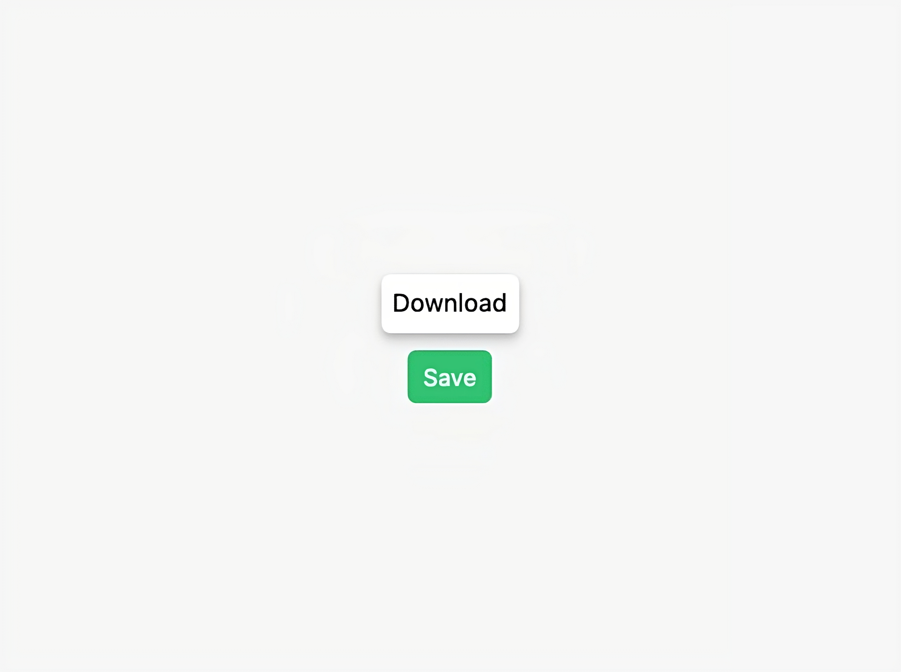

# tooltip




Lightweight (<2KB gzipped) tooltip component.

## Install

Install the `@react-sandbox/tooltip` package:

```bash
yarn add @react-sandbox/tooltip
# or
npm install @react-sandbox/tooltip
```

## Usage

Import the `Tooltip` component:

```tsx
import React from 'react'
import Tooltip from '@react-sandbox/tooltip'

function App() {
  return (
    <Tooltip title="Download" position="top" delay={200}>
      <button>Save ✅</button>
    </Tooltip>
  )
}
```

### Props

#### title

type: `string` (required)

Tooltip text content.

#### position

type: `'top' | 'bottom' | 'left' | 'right'` (default: `top`)

Tooltip position.

#### delay

type: `0 | 100 | 200 | 300 | 400 | 500 | 750 | 1000` (default: `200`)

Initial tooltip transition delay.

#### disabled

type: `boolean` (default: `false`)

Whether the tooltip is disabled or not.

**className**

type: `string`

Tooltip CSS classes.

## Development

### Local

```
yarn
yarn dev
```

### Storybook

```
yarn storybook
```

### Tests

```
yarn test
```

## License

MIT
