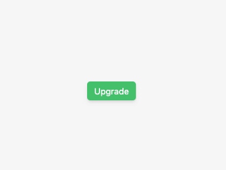

<h1 align="center">
  <a href="https://www.npmjs.com/package/@react-sandbox/tooltip">@react-sandbox/tooltip</a>
</h1>

<p align="center">
  
  
  
</p>

<p align="center">
  
</p>

<p align="center">Lightweight tooltip component.</p>

## Install

Install the `@react-sandbox/tooltip` package:

```bash
yarn add @react-sandbox/tooltip
# or
npm install @react-sandbox/tooltip
```

## Usage

Import the `Tooltip` component:

```tsx
import Tooltip from '@react-sandbox/tooltip'

function App() {
  return (
    <Tooltip title="Download">
      <button>Save ✅</button>
    </Tooltip>
  )
}
```

### Props

#### title

type: `string` (required)

description: Tooltip text content.

#### position

type: `'top' | 'bottom' | 'left' | 'right'` (default: `top`)

description: Tooltip position.

#### delay

type: `0 | 100 | 200 | 300 | 400 | 500 | 750 | 1000` (default: `200`)

description: Initial tooltip transition delay.

#### disabled

type: `boolean` (default: `false`)

description: Whether the tooltip is disabled or not.

**className**

type: `string`

description: Tooltip CSS classes.

## Development

### Local

```
yarn
yarn dev
```

### Storybook

```
yarn storybook
```

### Tests

```
yarn test
```

## License

MIT
